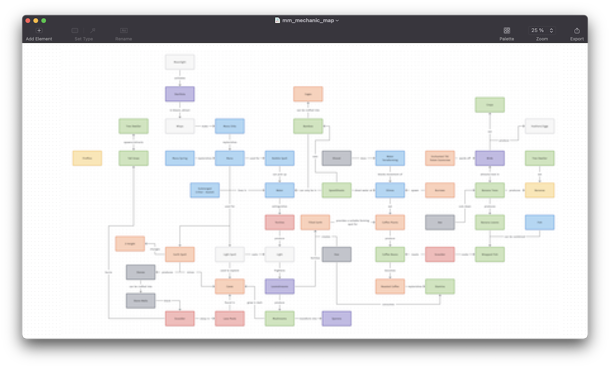

This is by no means a comprehensive list that must be followed strictly, merely a collection of methods that have helped me find focus over time.

---

#### Choosing the "right" tool

If you are a programmer like me, you are probably starting the development of your game by making the tech decisions first. Maybe you don't even have a game idea yet, maybe you do.

Should you use a commercially available engine off the shelf with all the bells and whistles already there and an entire ecosystem of plugins for you to pick and choose from? Should you code your own engine from scratch because you want to for learning purposes, to avoid paying royalties to Unity or Unreal or you have a game idea in mind that requires a completely custom approach?

Regardless of your reasons, the most pragmatic decision you can make here is to not stay in this stage too long. Don't spend years trying out different languages, engines and tools to only go back and forth between something you tried much earlier. It can be the first trap a lot of programmers fall into when starting a game and it's one I definitely fell for.

> **1.** Just pick a language and an engine or framework and stick with it. Whatever you find more productive and enjoy working with, just use it.

The key here is minimal cognitive overhead every time that you sit down to code. Do you enjoy working in this environment with this language and these tools? I think that aspect helps drive long term commitment. It also makes picking up your project after work a lot easier too if this is just something you do in your spare time.

Once you settle on an engine and you start coding away, maybe you start with some core functionality if the framework you have chosen is not as fully fledged as
other big game engines. Don't get caught in this step too long. It's okay to make a game engine as a learning exercise but draw a line the sand.

> **2.** Don't try build a fully featured generic game engine that can handle every type of game. Just get some basic pieces in place that you can prototype with. [^1]

#### Have an initial idea for a game

Ideas can be very spontanenous. They can happen randomly when you're not even thinking about them. They can happen when you're playing another game and wish that just one
thing was changed. Even simple combinations of two games that you haven't seen yet is a completely valid idea. Or even just a different implementation of another game that
already exists. These are just thoughts. Brief little moments of inspiration but they are by no means fully thought out ideas. Write them down, keep a note on your phone
or in a notebook. But pick one and try see how far you can go with it.

> **3.** List everything you want this game to have.

And I mean everything. Create a massive list, one that would take you years to implement. Save screenshots from other games or the internet to use as references in one big folder. This pool is just a collection of more inspiration but as you collect all this stuff it's quite possible that the full idea of this game will start forming in your head. Originally I did this with a combination of notes on my iPhone and even Github issues for features I wanted to implement but in the end this did not keep focused on what to actually build. The big list of ideas is still good to have though.

> **4.** Start prototyping that initial inspiration.

I like to treat inspiration and ideas separately. Inspiration is fleeting and very shortlived and it's often not a well-thought out concept in our minds. Developing that into
an actual idea takes time and experimentation. This is what you should start coding and determining. Emphasis on the word "start", prototyping is not just a single step in a list. The steps below will take you through some different methods I explored that helped me prototype effectively.

#### Prioritize what you prototype

As mentioned above, at one point I had many lists of what I wanted my game to have. They were in notes on my phone and I had just under one hundred Github issues for my project organized into categories. I had a vision in my head about how I wanted my game to look and sort of play but ironically the actual gameplay was still very unclear. At this point though I was just chasing productivity. I often started systems, put down my project for a while, came back and started something different. My first goal was to start finishing things. So what did I do?

> **5.** Make a list of goals you want to finish by the end of the year.

I set out to implement about 8 features by the end of the year and I did find that this started helping me focus better. I found gameplay elements were driving some additional engine work but at least it was engine work that was needed. For example, I didn't have any sound library incorporated in my game. As I added the first creature to my game, I included [Fmod](https://www.fmod.com/) to bring them more to life. This method felt good for a while but it still didn't quite feel like I was getting closer to an actual playable prototype. I had mostly picked a mix of tasks that were gameplay related as well as some tasks that were easier than larger features so that I could finish them by the
end of the year. I was starting to get a picture of what I was building but I hadn't really done any actual game design just yet.

> **6.** Map out the actual gameplay and how everything interacts.

There's [this article](https://www.gamedeveloper.com/design/5-practical-game-design-tools-to-help-design-your-game) I had saved a while back on game design exercises and one of my favourite methods from it was mechanics maps. I am making a game that has a high amount of interactions between entities in the game world. When I say high interactivity, think Breath of the Wild and its [Chemistry Engine](https://www.youtube.com/watch?v=QyMsF31NdNc) only a bit different. With lots of different entities and lots of ways that they can interact with each other, it is key to make sure that there is a balance of pros and cons for every entity and how they behave. I found that [Diagrams](https://diagrams.app/) on Mac is a great simple tool for doing this. In one evening I managed to map out more than enough gameplay behaviour in a really short span of time:

{: .post-image }

> _I have blurred this because I have not announced my game yet and I would prefer to keep it secret for now. The article that I linked above has got some good unobfuscated examples._

That's great! Now we have a more clear vision of how the game could actually play. We have taken that big list of ideas (or most of the important ones at least) and visualized them in a very holistic way. Prioritizing this is simply a matter of picking which entities and interactions are most key and working our way out from there.

> **7.** Break down your prototype into stages with its core elements.

I came across [Tynan Sylvester's GDC talk](https://www.youtube.com/watch?v=VdqhHKjepiE) where he mentions how he chooses what to work on next. He effectively keeps one master list of everything that he could work on. Every now and then he will reevaluate the list and move features that are higher priority up in the list. This method naturally sorts the list over time so that by the time you need a new task to work on, you have already considered all the other work you could be doing and you know that you are focusing on what is most important. He uses Google Docs for this. I personally found that Jira's free tier does the business just fine. I can reorganize everything in the backlog and you can organize milestones either into sprints or epics depending on how you want to group things. With the Jira app on your phone, you can even reprioritize features on the go if you have time to kill and you are away from your computer.

---

I hope this post helps someone else out there who is stuck in one of these phases. Each new approach can feel like an improvement over the last but can still have its own pitfalls. By constantly reevaluating what your focus is and ensuring that your upcoming task list has already been considered well ahead of time, I think you will find that your game idea realizes itself a lot sooner.

---

[^1]: It's a bit outdated now as it was built on SDL 1.2 but 2DBoy's [Rapid Prototyping Framework](https://github.com/goofans/2dboy). They made World of Goo.
